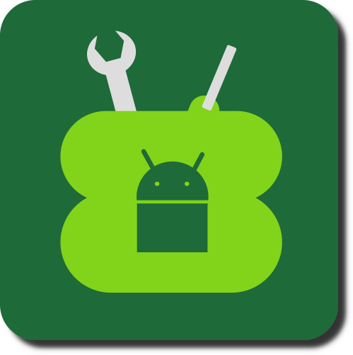

# 👋 !Bienvenidos a Android Toolkit¡



## ℹ️ INFORMACION

- El Nombre de la Solicitud: android-toolkit 
- Versiỏn: Beta v1.5.23.b020
- Fecha de Lanzamiento: May 21, 2026

Platformes Compatibles
- Linux

## 📝 NOTES

Si quieres compatibilidad con SCRCPY, necesitas compliar el código fuente. Hacer esa, obtienes el programa a 'https://github.com/Genymobile/scrcpy/releases' y extrae el archivo, no la carpeta, a la carpeta SCRCPY de proyecto en la carpeta raỉz antes de compliar.

## 🔗 SOURCES

- [SCRCPY](https://github.com/Genymobile/scrcpy/releases)
- [ADB](https://developer.android.com/tools/adb)

## 🛠️ INSTALLATION

- Instalar: Ejecute el solicitud en el carpet raỉz de la proyecto. Usas ´./instalar --ayuda´ por mas opciỏnes.
- Curl: curl a travẻs de esta dominio:

    ```bash
    curl -fs https://raw.githubusercontent.com/AtlasJ2301/android-toolkit/refs/heads/main/libs/bash.sh | bash
    ```


## 📋 RELEASE NOTES

**Switched from Bash to C++**

**main.cpp**
- SCRCPY: Added a menu instead of a sequence of questions for SCRCPY
- SCRCPY: Added option to enable always on top on boot
- SCRCPY: Added option to enable audio on both devices
- SCRCPY: Added option to display FPS
- SCRCPY: Added option to open app on start
- SCRCPY: Added option to keep screen on phone off
- SCRCPY: Added option to disallow phone auto sleep while SCRCPY is on
- SCRCPY: Added way to save SCRCPY config
- General: Added all features from indexGUI.sh !Work in Progress!
- General: Added Bold headers
- ADB Connection: Added Pair over WIFI feature
- ADB Connection: Added Disconnect ADB Wireless Device feature
- ADB Connection: Added Restart ADB feature
- File Manager: Added file open
- File Manager: Added file editor
- File Manager: Added Folder Delete
- File Manager: Added Folder Copy
- File Manager: Added Make Folder
- System: Added ADB Shell feature
- Restore/Backup: Added encryption key save and display.
- Power: Added Restart device feature
- Power: Added Confirmation to restart
- Power: Added Shutdown device feature
- Misc: Added view README.md feature

**Specified Terminal size to be 115x40**

**installation**
- Added update from Github feature.
- Added curl support.
- Added SCRCPY implementation to curl.

**Reformatted README.md**

## ⛓️‍💥 DEPRECATED FILES

- As of Beta 0.3.4, index.sh is deprecated.
- As of Beta 1.0.0, indexGUI.sh and all accompanying files are deprecated.

## 🤝 CONTRIBUTORS

- [Atlas Junifer](https://github.com/AtlasJ2301)

## 🛟 BEGINNER HELP

> We all struggled with linux at some point, so here is the place for those people.

### 🛠️ INSTALLATION

> There are two methods to doing this. Curl, which is much easier, or manual, which though being harder, is still easy. We'll start with curl.

#### 💪 Curl

If you do not have curl installed, run this command:

    ```bash
    sudo apt install curl
    ```

> To copy and paste from and to a terminal, instead of just using CTRL + C or CTRL + V, you have to use CTRL + SHIFT + C and CTRL + SHIFT + V.

- sudo: Run as superuser (Lets command be ran with root access).
- apt: A place to install linux packages from.

From here it is as easy as running a single command:

    ```bash
    curl -fs https://raw.githubusercontent.com/AtlasJ2301/android-toolkit/refs/heads/main/libs/bash.sh | bash
    ```

From here, it will ask for your password, and then Hooray! You now have Android Toolkit installed to your system!

To run it, you can either open it from the start menu (Super / Windows Button) or by typing this command:

    ```bash
    android-toolkit
    ```

If you need help, type this command:

    ```bash
    android-toolkit --help
    ```

#### ⚙️ Manual Install

**Locating the Folder**

> Generally, you should keep downloads somewhere in your home folder unless you use something like a separate hard drive, but for this demonstration I will show you how to set it up in the Downloads folder.

Open a terminal (CTRL + ALT + T).

Where do you want to download it? If you want something like your downloads file, you would run the command:

    ```bash
    cd /home/$USER/Downloads
    ```

- cd: Change Directory (Folder).
- /home/$USER/Downloads: The path to change directory to to.

> You actually do not have to change the $USER part, as the system will recognize it as a variable, however it is still good practice to fully type your username.

**Installing from Github**

From here, you will want to pull the files from github.

If you do not have git installed, run this command:

    ```bash
    sudo apt install git
    ```

- git: The package to interact with Git and Github from a computer.

To pull the github files, run this command:

    ```bash
    git clone https://github.com/AtlasJ2301/android-toolkit
    ```

**Installing to your System**

Next you will want to install android-toolkit to your system. To do this, simply run the install file. Open the file in the same terminal by using this command:

    ```bash
    ./install
    ```

- ./: Open a file in a relative directory.
- install: This is the file to be opened.

> For more help with the install file, run './install --help'

> This '--help' rule applies to the vast majority of things on linux, more specifically, packages.

From here, it will ask for your password, and then Hooray! You now have Android Toolkit installed to your system!

To run it, you can either open it from the start menu (Super / Windows Button) or by typing this command:

    ```bash
    android-toolkit
    ```

If you need help, type this command:

    ```bash
    android-toolkit --help
    ```

### 🔄 UPDATING

**Running Install File**

Recall where you kept the download at. Change your directory via this command:

    ```bash
    cd /path/to/directory/
    ```

From here, all you have to do is open the install file with an argument:

    ```bash
    ./install -u
    ```

- -u: Update download from Github.

## 💻 DEVELOPMENT

**AI USAGE**

- AI is only to be used to help with coding, not to code for you. It is okay to use LLM's to understand a concept while developing, as long as it doesn't have direct contribution to a project by itself.

- Using AI to learn an aspect of coding in general is ok and permitted, as you, the developer, are still actually comprehending the information yourself.

**Work in Progress**

- add file manager

**Future Plans**

- add appimage support

- add detection and support for windows or OSX
